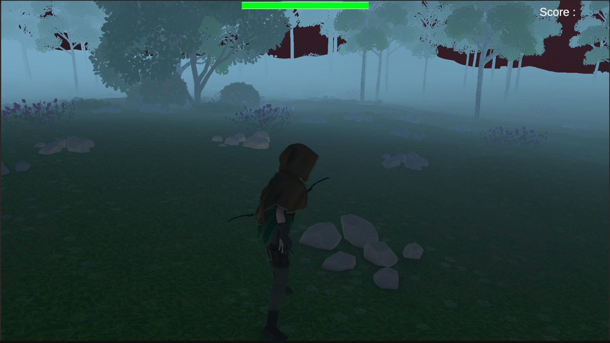
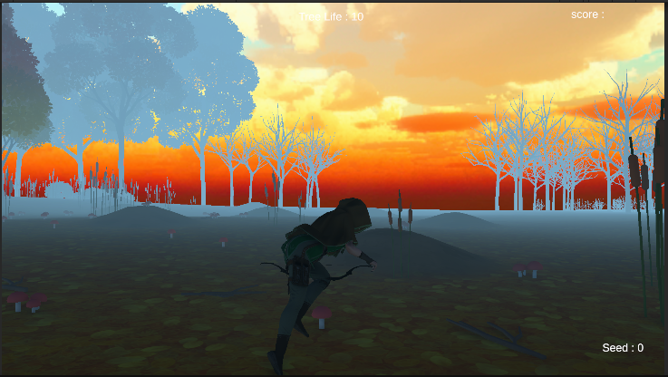
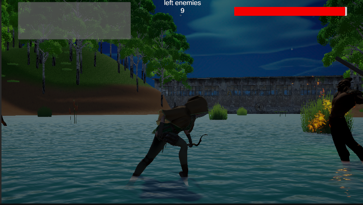
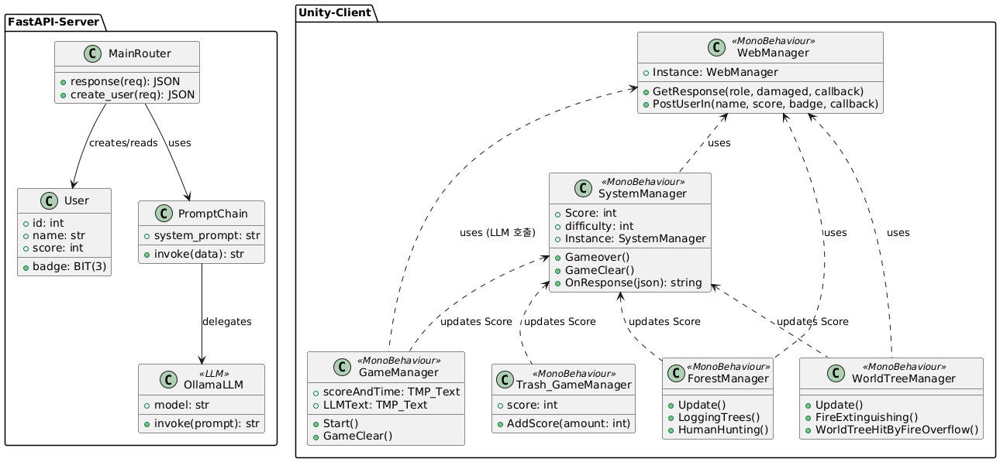
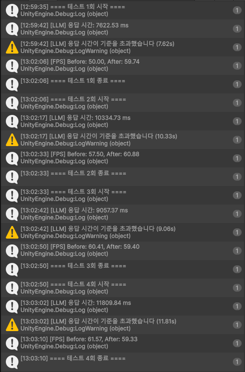
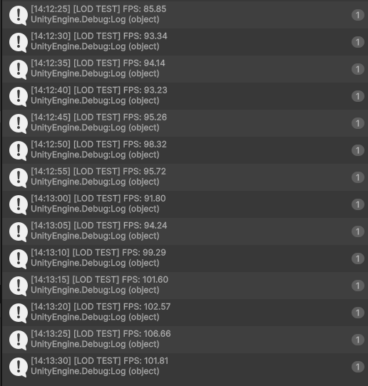
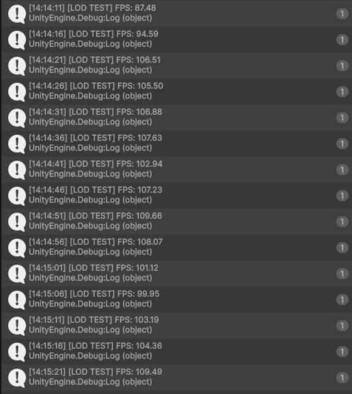

## Hallym 2025 Capstone Design

국내 환경인식 조사에 따르면 환경정보 접근성에 대한 평가는 낮은 반면(5점 만점 중 2.65점), 환경 만족도는 상대적으로 높게 나타나(3.08점) '인지-행동 간 간극(awareness-behavior gap)'을 보이고 있습니다. 정보 전달 중심의 전통적 환경 교육만으로는 이러한 간극을 좁히기 어렵다고 판단하여, 본 프로젝트는 사용자가 환경 파괴를 직관적으로 체감하고 일상 속 실천(분리배출, 담뱃불 소화 등)으로 이어지도록 유도하는 경험적 학습 게임을 목표로 합니다.

Unity 기반 인터랙티브 게임으로, 플레이어는 숲의 수호자 '엘프'가 되어 인간의 환경 파괴 행위를 저지하고 보상(Badge·Score)을 획득합니다. FastAPI와 LLM을 연동해 나무 정령·꽃 요정 등 식물 NPC와 대화할 수 있으며, 자연의 목소리를 담은 대사를 통해 인간-엘프 대립 구도 속에서 플레이어 스스로의 일상 행동을 성찰하도록 유도합니다.

## Tech Stack
Engine & Language: Unity 6 · C#

Backend & Model: FastAPI · Ollama · DeepSeek R1

- FastAPI + LLM 연동: UnityWebRequest 기반 REST 통신으로 플레이어 행동(스코어 등록 등)을 백엔드에 전송하고, Ollama로 구동되는 DeepSeek R1 모델의 응답을 파싱해 게임 내 대사로 표시합니다.

- 데이터 기반 에셋: Scriptable Object와 Cinemachine으로 카메라 파라미터를 분리해 재사용성을 확보했습니다.
- Object Pooling: 적 AI를 Queue 기반 풀로 재사용해 반복 스폰/파괴로 인한 GC 부하를 줄였습니다.
- NavMesh AI: 상태 기계(순찰/추격/작업)와 NavMeshAgent로 각 스테이지별 인간 NPC의 행동을 구현했습니다.
- 성능 자동 테스트: LLM 응답시간·FPS·폴리곤 수를 자동 측정하는 프로파일링 스크립트로 성능 기준을 검증했습니다.

| LLM 성능 테스트 | LOD 적용 전 | LOD 적용 후 |
|:---:|:---:|:---:|
|  |  | 

## Demo - 아래 이미지 클릭 시 YouTube로 이동합니다.
